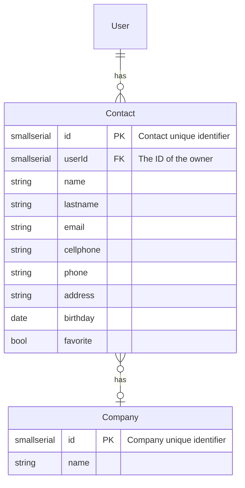

Powered by [mermaidJS](https://mermaid-js.github.io/mermaid/#/./entityRelationshipDiagram)

# Stack
- Server-side framework: [loopbackJS](https://loopback.io/doc/en/lb3/index.html)
- Database: [postgresql](https://www.postgresql.org/docs/
)

To ease the development process [docker](https://docs.docker.com/get-started/) has been integrated to run the database.

# Setup

1. Start database
`docker compose up`

2. If you need to stop the db
`docker compose down`

3. Add the database to DBeaver

# Instructions

2. Create model
`lb model contacts`

3. Add the listed properties to the contacts model

4. Add missing columns in db

5. Create model
`lb model company`

6. Add listed properties to the model

7. Start the API (you need to use node 12)
`npm start`

8. Go to API explorer
`localhost:3000/explorer`

9. Make a POST request to add a new Company

10. Get the company ID

11. make a POST request to add a new contact with the company ID that you got in the previous step
