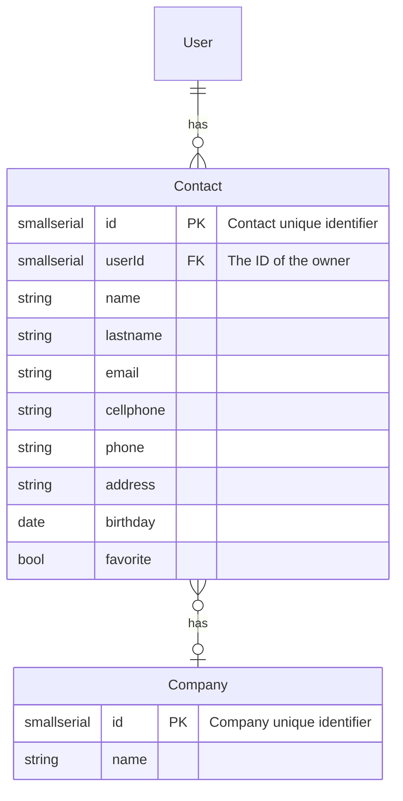

Powered by [mermaidJS](https://mermaid-js.github.io/mermaid/#/./entityRelationshipDiagram)

# Stack
- Server-side framework: [loopbackJS](https://loopback.io/doc/en/lb3/index.html)
- Database: [postgresql](https://www.postgresql.org/docs/
)

To ease the development process [docker](https://docs.docker.com/get-started/) has been integrated to run the database.

# Setup

# Instructions

1. Start database
`docker compose up`
`docker compose down`

2. Create models
`lb model`